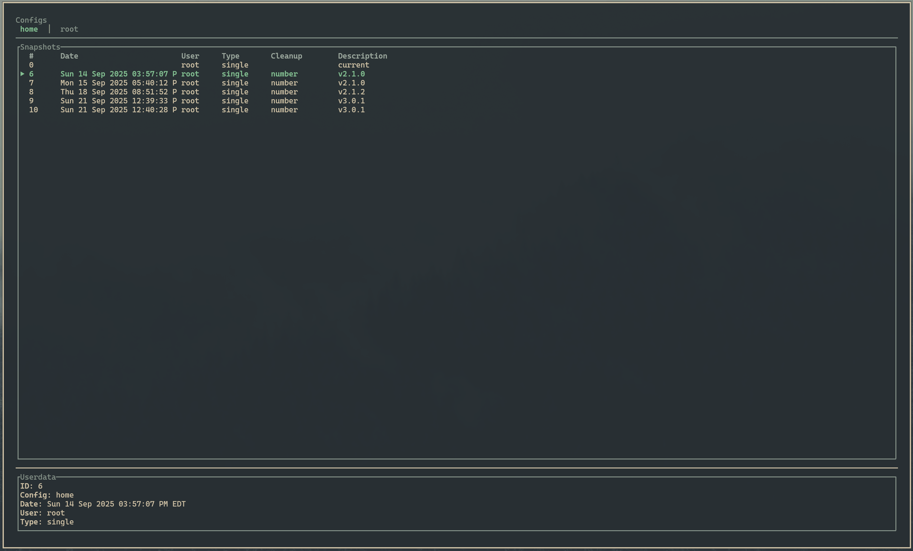
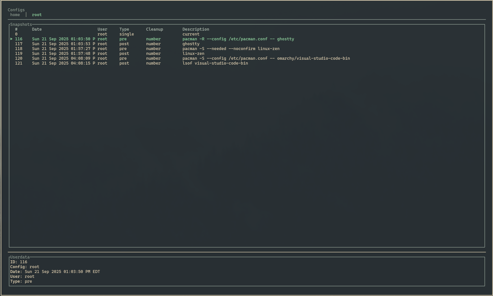
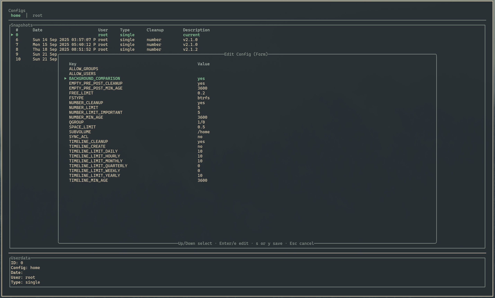
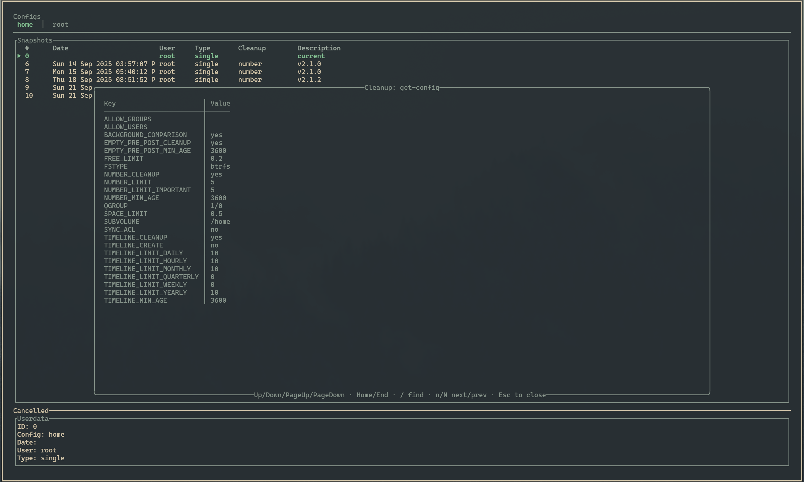
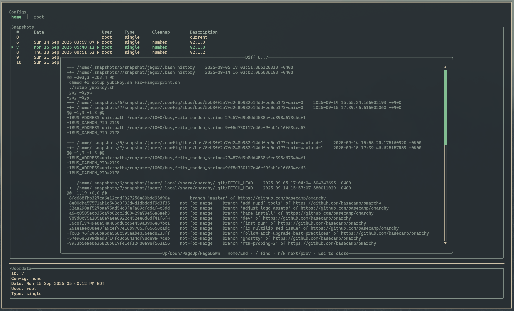
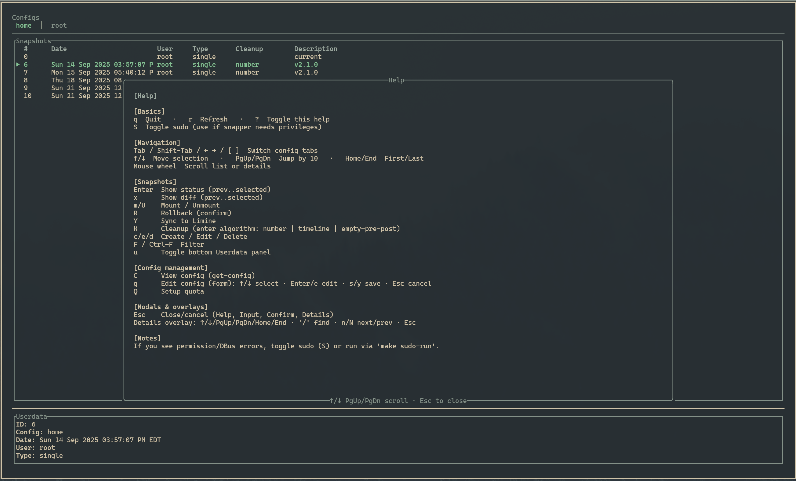

# Snapper TUI

[](https://github.com/j4v3l/snapper-tui/actions/workflows/ci.yml)

A clean, professional terminal UI for managing Snapper (Btrfs) snapshots, built with Rust and ratatui.

> Status: Beta — Work in progress
>
> This project is under active development. Expect bugs and breaking changes.
> Use at your own risk and ensure you have backups before performing destructive
> operations (delete, rollback, cleanup).

## Highlights
- Single-pane snapshots table with top tabs to switch configs
- Optional bottom "Userdata" panel showing details, mountpoint hints, and a background status summary
- Conditional scrollbars only when content exceeds the view
- Readable Help modal with bracketed headings and its own scrollbar
- CRUD: create, edit description, delete snapshots
- Status and diff helpers (prev..current or selected ranges)
- Mount/Umount, Rollback, Cleanup (number/timeline/empty-pre-post)
- Sudo-aware command runner; background jobs with debounced summaries
- Lightweight persistence of UI state

Recommended terminal size: at least 80x24. The UI updates live on resize and shows a hint if too small.

## Key bindings
- Navigation: Up/Down, PageUp/PageDown, Home/End, Mouse wheel
- Switch config tabs: Tab / Shift-Tab, or Left/Right
- Filter: F or Ctrl-F
- Toggle Userdata panel: u
- Actions: s status, i diff, m mount, U umount, r rollback, c cleanup
- CRUD: n create, e edit description, d delete
- Config ops: C view config, g edit config (form), Q setup-quota
- Help: ? · Quit: q

## Persistence
State is saved under the XDG config dir:
- Linux: `$XDG_CONFIG_HOME/snapper-tui/state.json` or `~/.config/snapper-tui/state.json`
- Saved fields: use_sudo, last_config, filter, show_userdata

## Requirements
- Linux with `snapper` installed and configured
- Some operations require elevated privileges; toggle sudo in-app or run via sudo if needed

## Build
```bash
cargo build --release
```

## Run
```bash
cargo run --release
```

If your system requires root for snapper:
```bash
sudo -E cargo run --release
```

## Quick start (Makefile shortcuts)

```bash
make help         # list targets
make build        # debug build
make run          # run debug
make release      # release build
make run-release  # run release
```

## Screenshots

<details>
<summary>Click to expand gallery</summary>

Below are sample views of the TUI in action.

<!-- The images are kept in the screenshots/ directory. Add more as the UI evolves. -->













</details>

## Notes
- This TUI wraps `snapper`. If you see permission/DBus errors, toggle sudo or run via sudo.
- Snapshot parsing is robust and supports explicit columns when available, with fallbacks for older snapper.

## License and attribution
GPL-3.0-or-later. If you use or redistribute this project, please provide attribution (see NOTICE).

## Contributing
See CONTRIBUTING.md. For local checks, run: `cargo fmt`, `cargo clippy -D warnings`, and `cargo test`.

